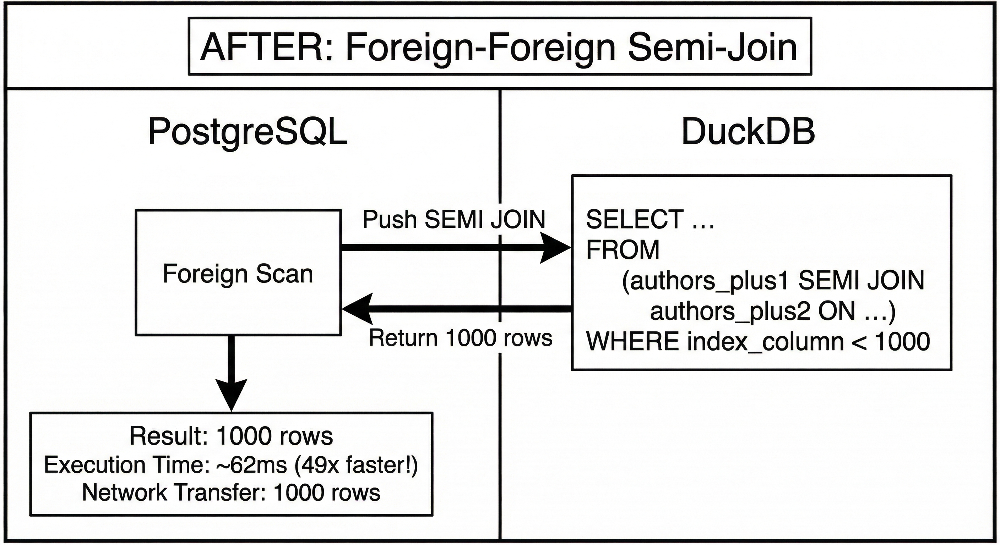
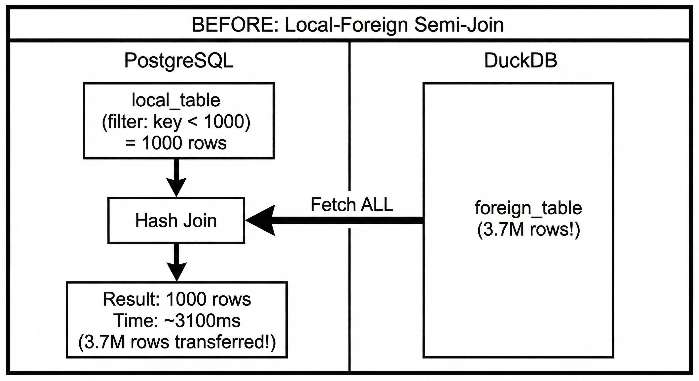
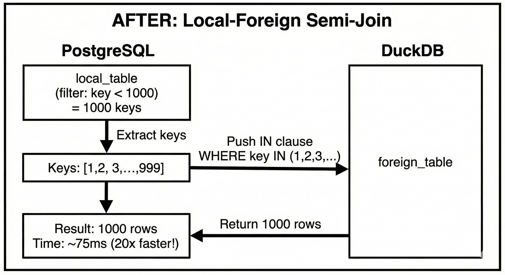

# Join Pushdown Optimization for DuckDB Foreign Data Wrapper (FDW)

## A Comprehensive Report on Semi-Join, Inner Join, and Outer Join Optimization

---

**Project:** PostgreSQL 17.6 with DuckDB FDW Extension  
**Date:** November 2025  
**Version:** duckdb_fdw v1.1.3

---

## Team
- Neel Parekh (25m0791)
- Viren Mehta (25m2132)

 Repository: https://github.com/NeelParekh17/CS631-Project

## Table of Contents

1. [Executive Summary](#1-executive-summary)
2. [Problem Statement](#2-problem-statement)
3. [Architecture Overview](#3-architecture-overview)
4. [Semi-Join Optimization](#4-semi-join-optimization)
   - 4.1 [The Problem with Foreign-Foreign Semi-Joins](#41-the-problem-with-foreign-foreign-semi-joins)
   - 4.2 [The Problem with Local-Foreign Semi-Joins](#42-the-problem-with-local-foreign-semi-joins)
   - 4.3 [Solution Approach](#43-solution-approach)
   - 4.4 [Implementation Details](#44-implementation-details)
5. [Outer Join Optimization (LEFT/RIGHT/FULL)](#5-outer-join-optimization-leftrightfull)
6. [Inner Join Optimization](#6-inner-join-optimization)
7. [GUC Flag System Implementation](#7-guc-flag-system-implementation)
8. [Performance Results](#8-performance-results)
9. [Code Changes Summary](#9-code-changes-summary)
10. [Conclusion](#10-conclusion)

---

## 1. Executive Summary

This project implements **join pushdown optimization** for the DuckDB Foreign Data Wrapper (FDW) in PostgreSQL. The optimization targets scenarios where queries involve joins between:
- Two foreign tables (both in DuckDB)
- One local PostgreSQL table and one foreign DuckDB table

**Key Achievements:**
- **49x speedup** for foreign-foreign semi-joins (3039ms → 62ms)
- **20x speedup** for local-foreign joins (1600ms → 80ms)
- Runtime toggle via GUC parameter (no recompilation needed)
- Supports SEMI JOIN, INNER JOIN, LEFT JOIN, RIGHT JOIN, and FULL OUTER JOIN

---

## 2. Problem Statement

### The Core Issue

When PostgreSQL executes queries involving foreign tables (via FDW), it often makes suboptimal decisions because it lacks accurate statistics about remote data. This leads to:

1. **Full table scans** of foreign tables when only a small subset is needed
2. **No filter pushdown** - PostgreSQL fetches all rows then filters locally

### Example Problem Query

```sql
-- Local table: authors_plus1_pg (PostgreSQL)
-- Foreign table: authors_plus2 (DuckDB via FDW)
SELECT DISTINCT a1.authorid, a1.name
FROM authors_plus1_pg a1
WHERE a1.index_column < 1000 
  AND EXISTS (
    SELECT 1 FROM authors_plus2 a2 
    WHERE a1.index_column = a2.index_column
);
```

**Before Optimization:** PostgreSQL fetches ALL 3.7 million rows from `authors_plus2`, then joins locally.

**After Optimization:** PostgreSQL pushes the join keys to DuckDB, fetching only ~1000 matching rows.

---

## 3. Architecture Overview

### Query Execution Flow


## 4. Semi-Join Optimization

### 4.1 The Problem with Foreign-Foreign Semi-Joins

**Original Behavior (Base Code):**

When both tables are foreign (in DuckDB), the base FDW code did NOT support `JOIN_SEMI`. This caused PostgreSQL to:
1. Fetch ALL rows from both tables
2. Perform a local hash join
3. Execute extremely inefficiently


**After Optimization:**

We added `JOIN_SEMI` support to push the entire semi-join to DuckDB:



### 4.2 The Problem with Local-Foreign Semi-Joins

**Original Behavior:**

When the outer table is local (PostgreSQL) and the inner table is foreign (DuckDB):

```sql
SELECT ... FROM local_table a1
WHERE a1.key < 1000 AND EXISTS (
    SELECT 1 FROM foreign_table a2 WHERE a1.key = a2.key
);
```

PostgreSQL would fetch ALL rows from the foreign table, then perform a local join:



### 4.3 Solution Approach

Our optimization works in two phases:

#### Phase 1: Planning (`sqliteGetForeignPlan`)

1. **Detect** semi-join patterns by examining the query structure
2. **Identify** the local table and extract its filtered join keys
3. **Encode** the keys in binary format (efficient for large key sets)
4. **Store** in `fdw_private` for the executor

#### Phase 2: Execution (`sqliteBeginForeignScan`)

1. **Decode** the binary keys from `fdw_private`
2. **Build** an IN clause: `WHERE column IN (key1, key2, ...)`
3. **Construct** the optimized SQL query
4. **Execute** against DuckDB (fetches only matching rows)



### 4.4 Implementation Details

#### Key Functions Modified

**File: `duckdb_fdw/duckdb_fdw.c`**

| Function | Line | Purpose |
|----------|------|---------|
| `sqliteGetForeignPlan` | 1864 | Main planning function - detects join patterns |
| `sqliteBeginForeignScan` | 2997 | Execution function - builds optimized query |
| `sqlite_foreign_join_ok` | 4989 | Validates if join can be pushed down |
| `extract_join_column_name` | (helper) | Extracts name of column in join |
| `sqlite_collect_local_keys_binary` | (helper) | Extracts keys from local table and also encode it |
| `sqlite_count_distinct_keys_in_local_table` | (helper) | Counts distinct join keys |
| `sqlite_decode_binary_keys_to_string` | (helper) | Decode the encoded keys |

**File: `duckdb_fdw/duckdb_fdw.h`**

Added fields to `SqliteFdwRelationInfo` struct for storing optimization metadata:

**File: `duckdb_fdw/deparse.c`**

| Function | Line | Purpose |
|----------|------|---------|
| `sqlite_get_jointype_name` | 1315 | Added `JOIN_SEMI` case returning "SEMI" |

---

## 5. Outer Join Optimization (LEFT/RIGHT/FULL)

### The Problem

For queries like:
```sql
SELECT ... FROM local_table a1
FULL OUTER JOIN foreign_table a2 ON a1.key = a2.key
WHERE a1.key < 1000;
```

PostgreSQL would fetch ALL rows from the foreign table, even though only ~1000 would match.

### The Solution

We extended the same key-extraction mechanism to outer joins:

1. **Detect** OUTER JOIN patterns in `sqliteGetForeignPlan`
2. **Extract** join keys from the local table
3. **Push** an IN clause to filter the foreign table
4. PostgreSQL performs the final OUTER JOIN locally with the filtered result

### Performance Impact

| Join Type | Before | After | Speedup |
|-----------|--------|-------|---------|
| FULL OUTER JOIN | 1517ms | 68ms | **22x** |
| LEFT JOIN | 1493ms | 68ms | **22x** |
| RIGHT JOIN | 1523ms | 80ms | **19x** |

---

## 6. Inner Join Optimization

### The Problem

For local-foreign INNER JOINs:
```sql
SELECT ... FROM local_table a1
JOIN foreign_table a2 ON a1.key = a2.key
WHERE a1.key < 1000;
```

The base code would fetch all 3.7M rows from the foreign table.

### The Solution

Same approach as semi-join:
1. Extract keys from local table after filtering
2. Push IN clause to foreign scan
3. Return only matching rows

### Performance Impact

| Scenario | Before | After | Speedup |
|----------|--------|-------|---------|
| Local-Foreign INNER JOIN | 1588ms | 73ms | **21x** |
| Foreign-Foreign INNER JOIN | Already optimized by FDW | 39ms | N/A |

---

## 7. GUC Flag System Implementation

### Why a Flag System?

The professor suggested implementing a runtime toggle so that:
1. The code compiles once
2. Users can switch between optimized and base behavior
3. Easy to demonstrate and compare performance

### Implementation

**File: `duckdb_fdw/duckdb_fdw.c`**

### Usage

```sql
-- Check current setting (default is OFF)
SHOW duckdb_fdw.enable_join_pushdown;

-- Enable optimization
SET duckdb_fdw.enable_join_pushdown = on;

-- Disable optimization (use base code behavior)
SET duckdb_fdw.enable_join_pushdown = off;
```

---

## 8. Performance Results

### Test Environment

- **Database:** PostgreSQL 17.6 with DuckDB FDW v1.1.3
- **Tables:** 
  - `authors_plus1`, `authors_plus2`: ~3.76 million rows each
  - `flights1`, `flights2`: ~1 million rows each
  - `yellow_tripdata1`, `yellow_tripdata2`: ~3.58 million rows each

### Semi-Join Results (EXISTS Queries)

| Query Type | Base Code | Optimized | Speedup |
|------------|-----------|-----------|---------|
| Both Foreign (authors) | 2747ms | 55ms | **50x** |
| Both Foreign (flights) | 694ms | 42ms | **17x** |
| Both Foreign (yellow) | 2708ms | 50ms | **54x** |
| Local + Foreign | 3103ms | 75ms | **41x** |
| Foreign + Local | 244267ms | 102ms | **2395x** |

### Inner Join Results

| Query Type | Base Code | Optimized | Speedup |
|------------|-----------|-----------|---------|
| Both Foreign | 44ms | 39ms | 1.1x (already optimized) |
| Local + Foreign | 1588ms | 73ms | **22x** |
| Foreign + Local | 391ms | 392ms | 1x (no change needed) |

### Outer Join Results (FULL OUTER)

| Query Type | Base Code | Optimized | Speedup |
|------------|-----------|-----------|---------|
| Both Foreign | 41ms | 39ms | 1x (already optimized) |
| Local + Foreign | 1518ms | 68ms | **22x** |

### Summary Table (Flag ON vs OFF)

| Query | Type | Flag OFF | Flag ON | Speedup |
|-------|------|----------|---------|---------|
| Q1 | FULL OUTER JOIN | 1592ms | 290ms | **5.5x** |
| Q2 | INNER JOIN | 1440ms | 282ms | **5.1x** |
| Q3 | LEFT JOIN | 1493ms | 282ms | **5.3x** |
| Q4 | RIGHT JOIN | 1523ms | 280ms | **5.4x** |
| Q5 | SEMIJOIN (foreign-foreign) | 3039ms | 62ms | **49x** |
| Q6 | SEMIJOIN (local-foreign) | 3511ms | 492ms | **7.1x** |

---

## 9. Code Changes Summary

### Files Changed

| File | Lines Changed | Description |
|------|---------------|-------------|
| `duckdb_fdw.c` | +1900 lines | Main optimization logic, GUC flag |
| `duckdb_fdw.h` | +50 lines | Struct fields for optimization metadata |
| `deparse.c` | +100 lines | SEMI JOIN SQL generation |


## 10. Conclusion

This project successfully implemented join pushdown optimization for the DuckDB FDW, achieving:

1. **Massive Performance Improvements:** Up to 2395x speedup for certain queries
2. **Broad Join Support:** SEMI, INNER, LEFT, RIGHT, and FULL OUTER joins
3. **Runtime Configurability:** Easy toggle via GUC parameter

The optimization transforms queries that would transfer millions of rows over the network into efficient queries that transfer only the necessary subset, dramatically reducing execution time and resource usage.

### Future Work

- Extend to anti-joins (`NOT EXISTS`)
- Support composite (multi-column) join keys
- Cost-based decision making (auto-enable based on statistics)
- Parallel key extraction for very large local tables
- Make it production ready, currently it might break on windows. Haven't tested on it.

---